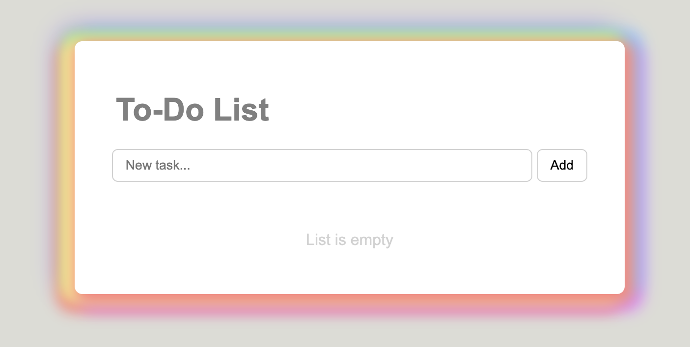

# To-Do App

A simple and clean to-do list application built with HTML, CSS, and JavaScript.  
Tasks are stored in the browser using localStorage.

---

## 🔗 Live Demo

https://todo-app-beryl-two-41.vercel.app/

---

## Preview

---

## Features

- Add new tasks
- Delete tasks
- Persistent data with localStorage
- Clean and minimal UI
- Responsive layout

---

## Tech Stack

- HTML
- CSS
- JavaScript (localStorage)

---

## Goal

Practice working with DOM manipulation and browser storage (localStorage) while building a functional UI component.
